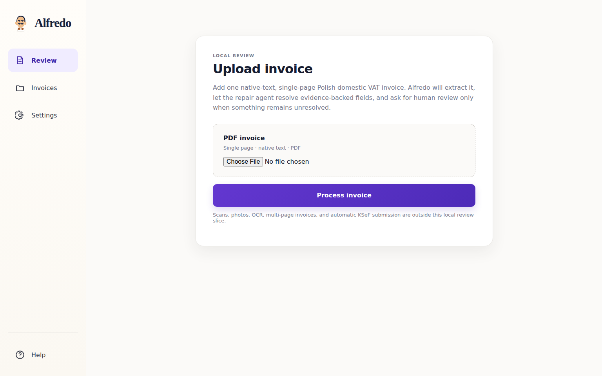
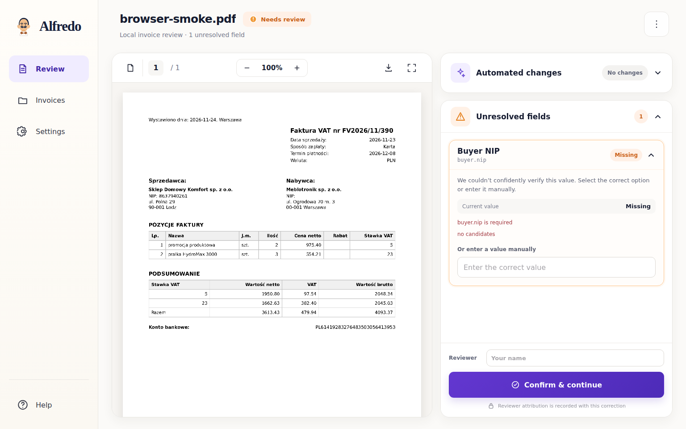

# 🧾 AlfredoTheClerk

[](https://github.com/komaksym/AlfredoTheClerk/actions/workflows/ci.yml)

**Evidence-constrained invoice repair for KSeF FA(3).**

Alfredo turns a supported legacy invoice PDF into a validated FA(3) XML file. It
automates evidence-backed fixes, sends ambiguous fields to a human, and never
lets the model invent replacement values.

> The goal is simple: automate the obvious fixes, never bluff on ambiguous ones.

## ✨ What Alfredo does

- 📥 Extracts invoice fields and source evidence from a native-text PDF.
- 🤖 Repairs only fields supported by existing evidence candidates.
- 🙋 Sends genuinely ambiguous or missing fields to human review.
- 🧪 Runs shell, totals, FA(3), and XSD correctness checks.
- 📤 Exports downloadable FA(3) XML after the invoice passes validation.

```text
PDF invoice
  -> deterministic extraction
  -> evidence-constrained repair
  -> human review when needed
  -> local correctness checks
  -> FA(3) XML
```

## 🖥️ Application

### Upload an invoice



### Review unresolved fields



The review workspace keeps the original PDF visible, shows accepted automated
changes as a read-only audit trail, and exposes only unresolved fields for human
correction.

## 📊 Controlled synthetic benchmark

Latest merged-code regression:

| Setup | Value |
| --- | --- |
| Commit | `3227d2c` |
| Model | `deepseek:deepseek-v4-flash` |
| Corpus | `agentic-repair-hard-v1` |
| Runs | 30 cases × 3 repeats |

| Metric | Result | What it means |
| --- | ---: | --- |
| Repair precision | **96.6%** · 85/88 | When Alfredo repairs a field, how often it is right |
| Repair coverage | **91.7%** · 88/96 | How many repairable fields Alfredo attempts |
| Safe-escalation rate | **100.0%** · 9/9 | Ambiguous fields correctly sent to a human |
| Field-decision accuracy | **89.5%** · 94/105 | Correct repairs and escalations across all agent fields |
| Manual-correction reduction | **57.8%** · 85/147 | Known defects removed from the human queue |
| Straight-through rate | **50.0%** · 45/90 | Case-runs completed without human correction |

### What the numbers say

✅ The agent repaired attempted fields with high precision.  
✅ Every genuinely ambiguous field was escalated safely.  
⚠️ The agent is still slightly conservative: repair coverage is lower than repair
precision.

The agent-disabled baseline requires one human correction for every persisted
known defect. Only a ground-truth-matching repair removes work from that baseline.

The benchmark also emits the legacy **candidate-selection accuracy** metric:
correct repairs divided by all repairable fields. It was **88.5%** on this run.
Repair precision and repair coverage are shown separately because they make the
abstention trade-off much easier to understand.

The hard corpus is a development regression set, not an untouched held-out
benchmark: its cases were inspected while designing safe abstention. This
controlled result does not establish production generalization or accountant
time savings.

Run the full three-repeat regression:

```bash
export DEEPSEEK_API_KEY="..."
uv run python -m src.agentic_repair.benchmark_runner \
  --runs 3 \
  --max-error-rate 0.05 \
  --json-out reports/agentic-repair-benchmark.json \
  --markdown-out reports/agentic-repair-benchmark.md
```

## 🚀 Run locally

Requirements: Python 3.13, `uv`, and a DeepSeek API key.

```bash
uv sync --locked
export DEEPSEEK_API_KEY="..."
uv run python -m src.review_ui
```

Open `http://127.0.0.1:8000`.

The local app does **not** automatically submit invoices to KSeF. Model-bound
field evidence is sent to the configured DeepSeek API only when agent repair is
required.

## 📄 Current scope

Supported today:

- one Polish domestic VAT invoice;
- single-page PDF;
- native text rather than a scan or photo;
- the invoice layouts covered by the current extraction pipeline.

Not supported in this implementation slice:

- scans, OCR, photos, and multi-page documents;
- correction or advance invoices;
- arbitrary layouts;
- automatic production KSeF submission.

## 🛡️ Safety boundary

- The model may select only existing extracted candidates. It cannot invent a
  replacement value.
- Every agent field receives exactly one explicit `repair` or `human_review`
  decision in a single tool call.
- Repairs are atomic. Unresolved fields stay in human review.
- Automated and human changes pass through the same correctness pipeline.
- XML download stays disabled until shell validation, totals reconciliation,
  FA(3) mapping, and XSD validation all pass.

## ✅ Validate

```bash
uv run ruff check .
uv run pyright src tests
uv run pytest -q -m "not browser_e2e and not ksef_live"
uv run playwright install chromium
uv run pytest -q -m browser_e2e
uv build --wheel
```

A separate strict CI job submits a synthetic invoice to KSeF TEST using repository
secrets. Missing credentials or a rejected submission fail the gate.
